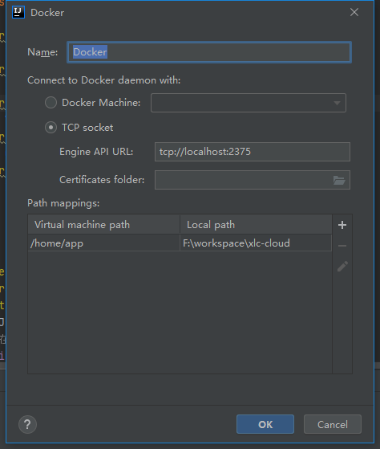

# idea 和 docker 联合使用

### 一、在你启动好的docker任务栏图标上，右击settings选项


## 二、Idea配置

1、确保Idea安装了docker插件

 


2、在项目根目录下新建Dockerfile,配置如下

```dockerfile
#指定基础镜像，在其上进行定制
FROM java:8
#指定作者
MAINTAINER jerry
#指定标签
LABEL name="mw-eureka" version="1.0" author="jerry"
#这里的 /home/app/work/eureka 目录就会在运行时自动挂载为匿名卷，任何向 /data 中写入的信息都不会记录进容器存储层
VOLUME /home/app/work/eureka
#复制上下文目录下的target/xlc-cloud-eureka-0.0.1.jar 到容器里
ADD  target/xlc-cloud-eureka-0.0.1.jar eureka.jar
#声明运行时容器提供服务端口，这只是一个声明，在运行时并不会因为这个声明应用就会开启这个端口的服务
EXPOSE 3000
#指定容器启动程序及参数   <ENTRYPOINT> "<CMD>"
ENTRYPOINT ["java","-jar","eureka.jar"]
```

3、配置Docker服务器



4、配置docker发布


5、打包


5、一键部署

(1)打开Dokcer窗口


(2)部署


(3)发布完成


至此，idea中的项目就已经发布到docker中了，然后就可以本地直接访问了。